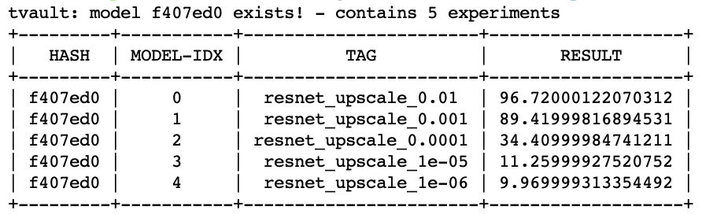
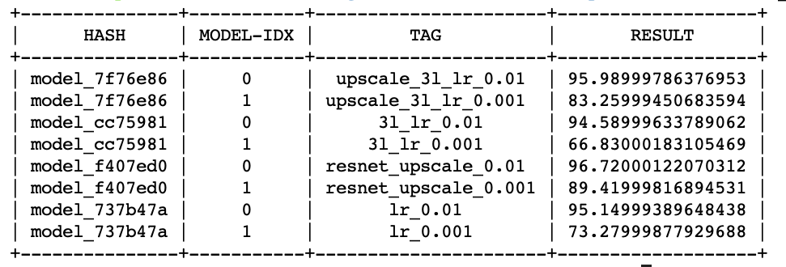
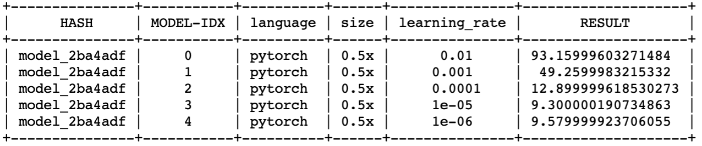
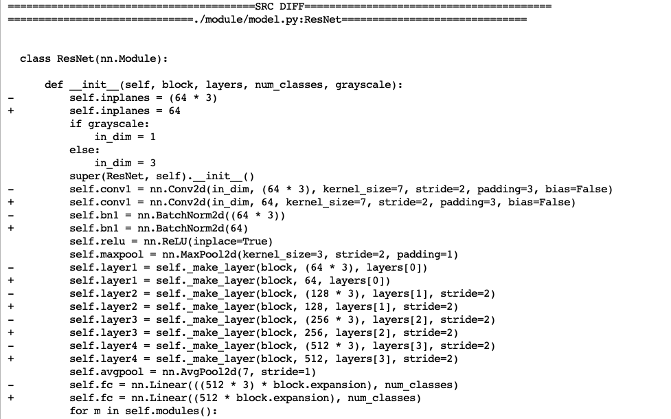

# mnist-tvault-example
Sample repository for classifying MNIST dataset with tvault model registry. 

## Description
This repository uses ResNet-18 model to classify MNIST dataset.
Since the purpose of the repository is to let you experience model registry, we set train epoch to 5.
In order to run experiment, run 

`python -u -m torch.distributed.launch --nproc_per_node {gpu_num} --use_env train.py`.

After experiment end, model registry will be created using statement in `train.py`

`tvault.log_all(model, tag=f"{tag}", result=f'{result}, optimizer=optimizer)`

While model registry uses the commit hash, multiple registries with different settings can be made in single commit. In this case, model indexes are used to differentiate different model experiments.

## Command line tools
Above command automatically generates model registry for your pytorch model. Your model registry (model related code, result, tag, metatdata ... ) will be saved in `model_log` directory. 

### tvault --find_flag
tvault find_flag option allows you to look up different expereiments with simple cli. find_flag offers three different ways of exploring results.

1. hash
`tvault --find_flag --condition hash --hash f407ed0` shows all experiments with hash `f407ed0`.

2. result
`tvault --find_flag --condition result --min 50 --max 100` shows all experiments with result value between 50 and 100.

3. tag
`tvault --find_flag --condition tag --tag upscale_3l_lr_0.01` shows all experiments with specified tag.

### tvault --diff_flag
tvault diff_flag option allows you to look up difference of two models by specifying model hash and index. tvault automatically detects functions that are realated to model, which removes git diffs that are **not** related to model.

`tvault --diff_flag --sha1 f407ed0 --index1 0 --sha2 737b47a --index2 0` 
provides the model difference between models in between two commits. 

